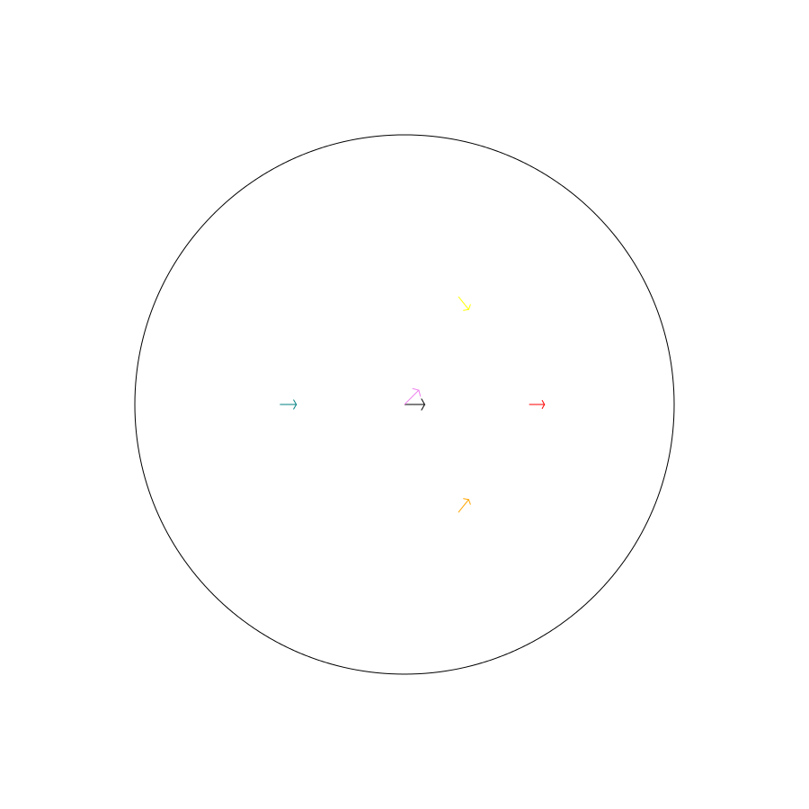
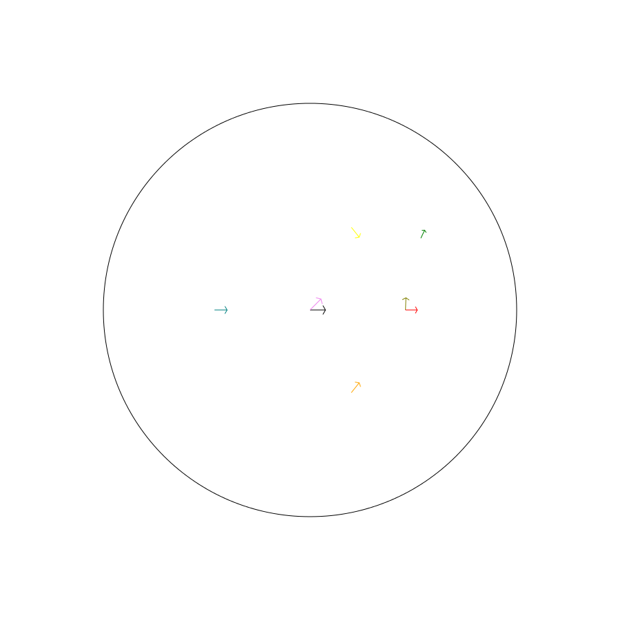
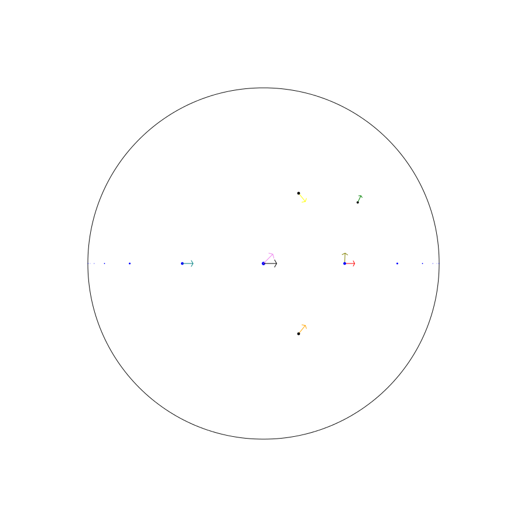
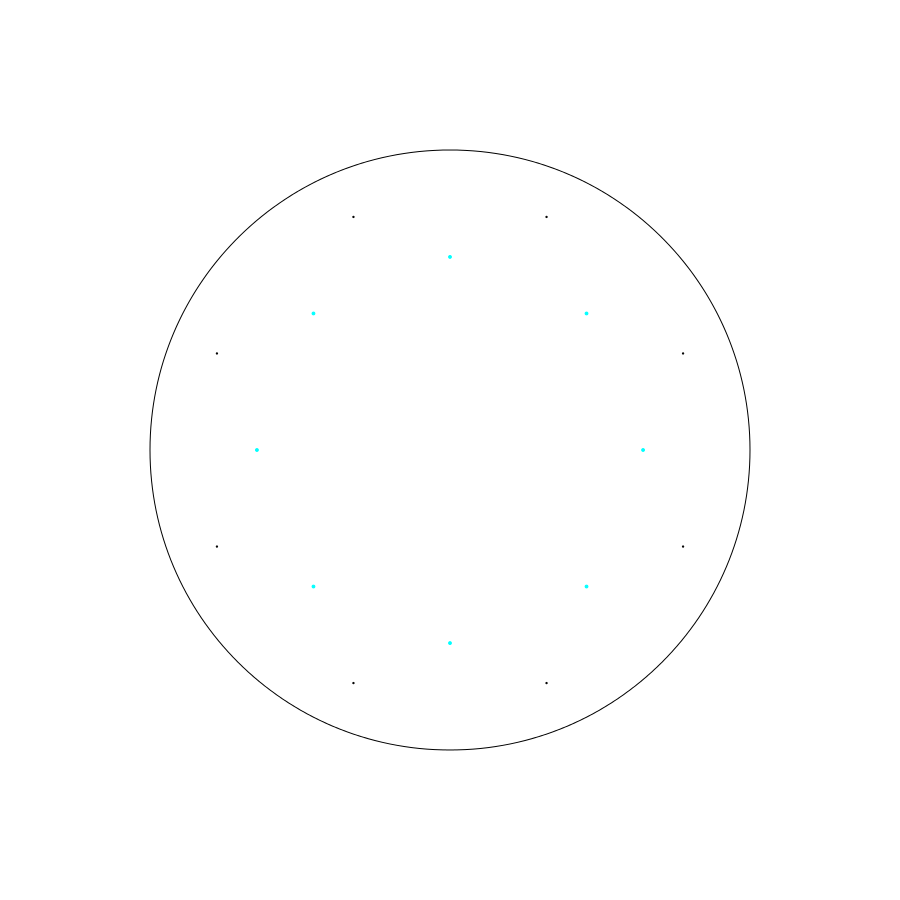
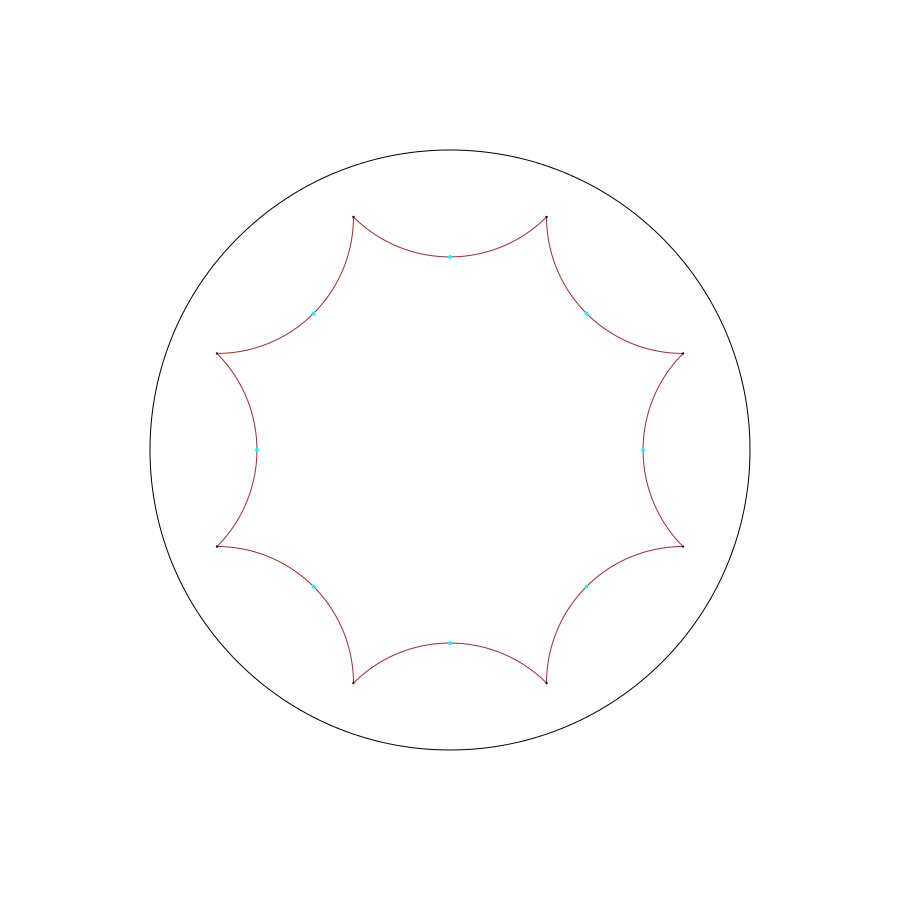
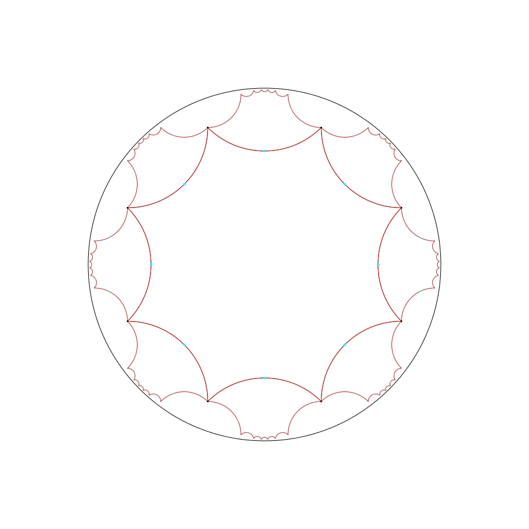
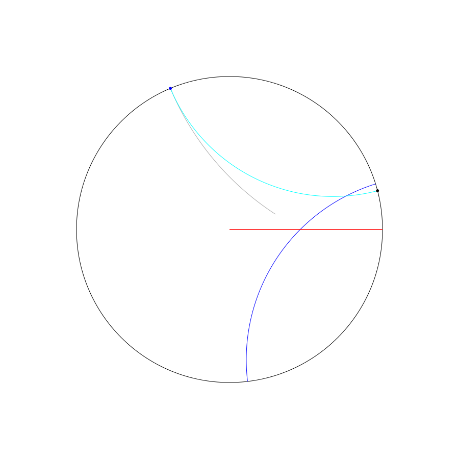
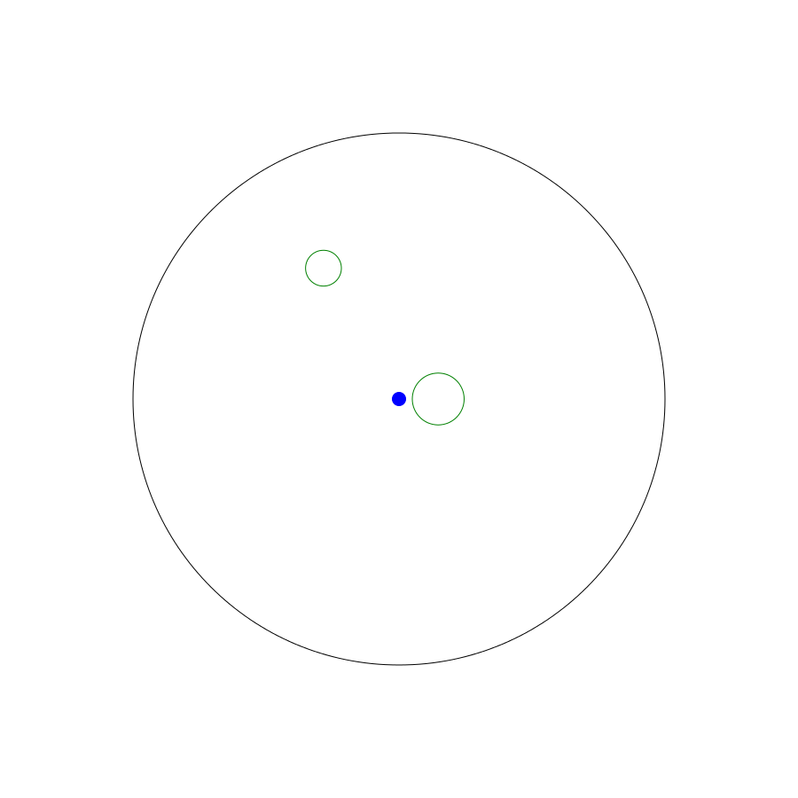

# Dibujos Hiperbólicos: Basic Tutorial

## Importing vs running from IDLE

I'm assuming you've downloaded the file "dibujos.py" from https://github.com/pablolessa/dibujos_hiperbolicos and you know that the program is supposed to help generate figures of the Poincaré disk model of the hyperbolic plane.

A nice way to use dibujos.py is from an interactive shell such as IDLE.  From IDLE you can open up "dibujos.py" and select "Run" from the menu or press f5.  

From an IPython notebook or if you want to work by writting a script and running several times while tweaking the image you should start with:

    from dibujos import *

## Creating an empty figure

To create an empty figure just do the following:

    f = Figure()

## Writting to pgf and svg files

At this point the figure "f" is empty.  But we can still output to either a pgf file (usable from LaTex via the Tikz package, or from programs like KTikz) or an svg (Scalable Vector Graphics, pretty much all web browsers know how to open this file type, also it can be converted to other vector formats such as eps using different programs such as Inkscape).

To do this we simply use the .writepgf or .writesvg methods of the Figure class.

    f.writepgf('emptyfigure.pgf')
    f.writesvg('emptyfigure.svg')

The output looks like this (here I'm showing the svg file):

## Adding drawables to a figure

This is all good and well but at somepoint you're going to want to actually draw something in the disk.   Dibujos provides several "drawables" which are classes whose instances can be added to a figure.

To be concrete the drawables are:  Point, Boundarypoint, Tangent, Segment, Halfline, Line, Circle, and Disk.

### Tangents

The most important drawable class is Tangent.  Tangent objects represent unit tangent vectors to the disk.  They can be created in several ways.  Here's one.

    t = Tangent.origin()
    f.add(t)
    f.writesvg('tangent.svg')

The constuctor Tangent.origin() gives the unit tangent vector at the center of the disk pointing right.

The Tangent.forward(d) constructor gives a tangent vector which is at distance d from Tangent.origin() along the geodesic (the distance is in hyperbolic units of course).

The Tangent.rotate(angle) constructor gives tangent vector which is rotated a angle from Tangent.origin() in the counter-clockwise sense.

The Tangent.sideways(distance) constructor gives a tangent vector to the right of Tangent.origin() on the same (stable) horocycle (a horocycle is viewed in the Poincaré disk model as an Euclidean circle tangent to the boundary circle).

    forward = Tangent.forward(1)
    backward = Tangent.forward(-1)
    rotated = Tangent.rotate(pi/4)
    right = Tangent.sideways(1)
    left = Tangent.sideways(-1)
    f.update([forward,backward,rotated,right,left])
    f.writesvg('moretangents.svg')

Here we used the Figure.update method which adds a sequence of drawables to a figure.   In short, use f.add if you want to add a single drawable to a figure f but use f.update if you want to add more than one at the same time.   You can use f.add(g) to add all drawables in a figure g to a figure f for example.

Tangents are drawn so that their hyperbolic length is constant.  This means tangents get smaller if they are close to the boundary.

### Colors

I think this is a good moment to introduce colors.   Every drawable has a .color attribute which can take any of the following values: 'red' 'green' 'blue' 'cyan' 'magenta' 'yellow' 'black' 'gray' 'darkgray' 'lightgray' 'brown' 'lime' 'olive' 'orange' 'pink' 'purple' 'teal' 'violet' 'white'

One can change the color of a tangent either by changing the attribute directly or by calling a one of the folowing functions on it: Red Green Blue Cyan Magenta Yellow Black Gray Darkgray Lightgray Brown Lime Olive Orange Pink Purple Teal Violet.

    forward.color = 'red'
    Teal(backward)
    Violet(rotated)
    Yellow(left)
    Orange(right)
    f.writesvg('moretangentswithcolors.svg')

## Tangents are isometries

For each unit tangent vector "t" there is a unique orientation preserving isometry (i.e. hyperbolic distance preserving transformation) of the disk which sends Tangent.origin() to "t".   One can get the result of applying this transformation to any drawable (including other tangents) by using the notation "t*drawable".

This is a good way to construct tangents.

    f.add(Olive(Tangent.forward(1)*Tangent.rotate(pi/2)))
    f.add(Green(Tangent.forward(1)*Tangent.rotate(pi/2)*Tangent.forward(1)))
    f.writesvg('tangentsareisometries.svg')

## Points

Points represent what one might expect.   A simple way to get a point is by using the .basepoint attribute of a tangent vector.  Another is by calling Point(z) where z is a complex number of modulus less than one (for example Point(0) gives a point at the center of the disk).

They can be colored as expected.  And acted on by tangents as explained above.

    f.update([Tangent.forward(i)*Blue(Point(0)) for i in range(-10,11)])
    f.add(left.basepoint)
    f.add(right.basepoint)
    f.add(Tangent.forward(1)*Tangent.rotate(pi/2)*Tangent.forward(1)*Point(0))
    f.writesvg('points.svg')

### Other constructors for Points

Since points are so important there are a number of constructors.   You can construct a point from polar coordinates by using Point.frompolar(angle=something, radius=somethingelse).

Also you can get them from other models of the hyperbolic plane, such as the upper half plane model, the klein model, or the hyperboloid model but I wont give examples here.

Also, don't forget that you can get new points from old ones by multiplying by tangents.   Here are vertices and the midpoints of the sides of a regular octogon which tiles the hyperbolic plane fitting exactly 8 copies at each vertex.

    r = acosh(1/tan(pi/8))
    octogonmidpoints = [Cyan(Point.frompolar(radius=r,angle=2*pi*i/8)) for i in range(8)]
    p = Tangent.forward(r)*Tangent.rotate(pi/2)*Tangent.forward(r)*Point(0)
    octogonvertices = [Tangent.rotate(2*pi*i/8)*p for i in range(8)]
    f.update(octogonmidpoints+octogonvertices)
    f = Figure(octogonmidpoints+octogonvertices)
    f.writesvg('octogonpoints.svg')

## Segments

Segments are finite length hyperbolic geodesic segments.  They are constructed by giving the start and endpoint (which must be Point instances).  They can also be colored of course.

Let's add sides to our octogon.

    for i,p in enumerate(octogonvertices):
        q = octogonvertices[(i+1)%8] # the next vertex in cyclic order
        f.add(Brown(Segment(p,q)))

    f.writesvg('octogonwithsides.svg')

## Acting on figures with Tangents

You can multiply a figure f by a tangent t and the result is a new figure obtained by multiplying each drawable in f by t.

Here's an example:

    right = Tangent.forward(2*r)
    left = Tangent.forward(-2*r)
    upright = Tangent.rotate(pi/4)*Tangent.forward(2*r)*Tangent.rotate(-pi/4)
    downleft = Tangent.rotate(pi/4)*Tangent.forward(-2*r)*Tangent.rotate(-pi/4)
    up = Tangent.rotate(pi/2)*Tangent.forward(2*r)*Tangent.rotate(-pi/2)
    down = Tangent.rotate(pi/2)*Tangent.forward(-2*r)*Tangent.rotate(-pi/2)
    downright = Tangent.rotate(-pi/4)*Tangent.forward(2*r)*Tangent.rotate(pi/4)
    upleft = Tangent.rotate(-pi/4)*Tangent.forward(-2*r)*Tangent.rotate(pi/4)

    g = right*f
    g.update(left*f)
    g.update(upright*f)
    g.update(downleft*f)
    g.update(up*f)
    g.update(down*f)
    g.update(downright*f)
    g.update(upleft*f)
    g.update(f)

    g.writesvg('someoctogons.svg')

## Halfline, Line, and boundary points

The Boundarypoint class is provided to represent points on the boundary of the disk.  They are constructed using the constructor "Boundarypoint(angle)" where the angle is measured counter-clockwise from the positive real axis (so Boundarypoint(0) gives the rightmost point of the boundary circle).  They can be drawn, acted on by tangents, etc.

A Halfline instance represents half of a hyperbolic geodesic.  It can be initialized using a Tangent (representing the starting point and direction).   Also one can give two points, the second of which is a boundary point, using the Halfline.fromtwopoints constructor.

Lines represent complete hyperbolic geodesics.  They can be created by giving a Tangent (any tangent on the desired line) or by giving two boundary points using the Line.fromtwopoints constructor.

Here are some random examples:

    import random

    g = Figure()

    g.add(Red(Halfline(Tangent.origin())))

    alpha = 2*pi*random.random()
    beta = 2*pi*random.random()
    boundarypoint1 = Boundarypoint(alpha)
    boundarypoint2 = Boundarypoint(beta)

    g.add(boundarypoint1)
    g.add(Blue(boundarypoint2))

    half = Red(Halfline(Tangent.origin()))
    line = Blue(Line(Tangent.rotate(pi/4)))

    g.add(half)
    g.add(Tangent.forward(1)*line)

    g.add(Darkgray(Halfline.fromtwopoints(Point(0.3+0.1*1j),boundarypoint2)))
    g.add(Cyan(Line.fromtwopoints(boundarypoint1,boundarypoint2)))

    g.writesvg('lines.svg')

## Circles and disks

One can draw hyperbolic circles (which happen to be Euclidean circles as well) and disks (i.e. filled in circles).  The constructors are pretty obvious and accept a Point and a radius.

    g = Figure()
    greencircle = Green(Circle(Point.frompolar(radius=0.3,angle=0),0.2))
    g.add(greencircle)
    g.add(Tangent.rotate(2*pi/3)*Tangent.forward(1)*greencircle)
    g.add(Blue(Disk(Point(0),0.05)))
    g.writesvg('disks.svg')

## Stickman and modulargoup

We provide a function stickman admitting a parameter size which returns a figure containing a rudimentary stickman (made out of Segments and a Circle).

Since it's a figure you need to use .update to add it to any figure of yours.

    f = Figure()
    f.update(Tangent.forward(1)*Tangent.rotate(pi/2)*stickman(size=0.3))
    f.writesvg('stickman.svg')

We also provide a generator modulargroup(n) which generates the ball of radius n in the modular group (basically a bunch of tangents generated as products of Tangent.rotate(pi) and Tangent.sideways(1)).  This can be used to produce nice pictures such as the following:

    g = Figure()
    for t in modulargroup(15):
        g.update(t*f)
    g.writesvg('morestickmen.svg')

# Future

The priority for future work is:
- Creating a gallery of examples and fixing any bugs that might arise while doing so.
- Adding generators for other Fuchsian groups (besides the modular group).
- Adding other drawables such as horocyles and equidistant curves.

This last item is not a high priority.  And I want to avoid adding too many drawables to keep the API simple and easy to learn and use.
